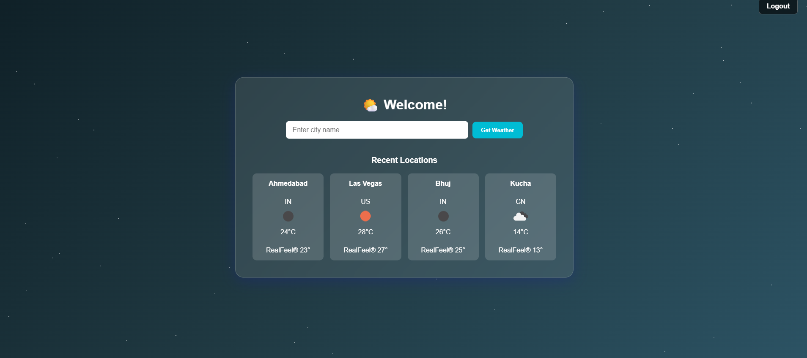

# Weather App 🌤️

A simple and responsive weather application built using PHP, JavaScript, and HTML. The app allows users to search for weather information of any city and displays current weather conditions along with forecasts.

## Features

- Search weather by city name
- Display current weather conditions
- Responsive and mobile-friendly UI
- Admin dashboard to manage app data
- User-friendly interface with real-time updates

## Screenshots

  
  
 

